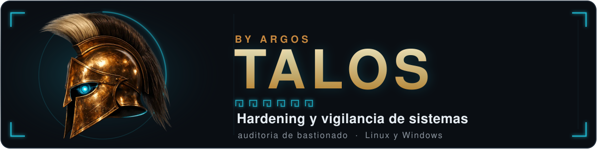
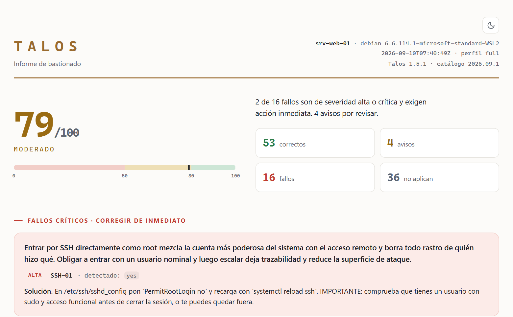
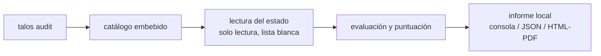
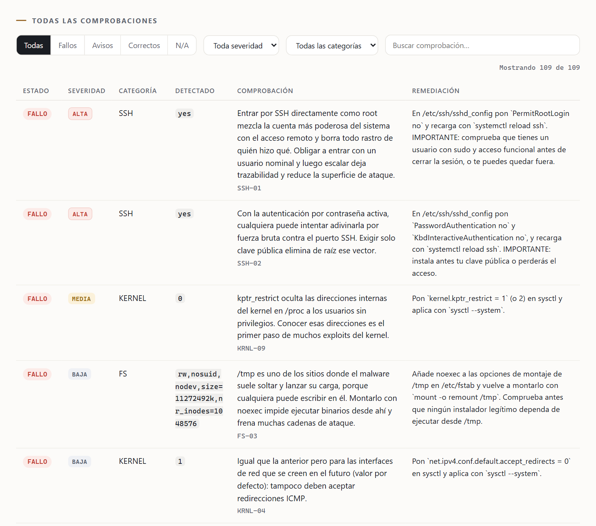

<p align="center">
  
</p>

# Talos

Talos audita el bastionado (*hardening*) de un equipo y le pone nota. Lee cómo está configurada
la máquina, compara ese estado con un catálogo de 147 comprobaciones y devuelve un índice de 0 a
100 con la lista de lo que falla y de cómo se arregla cada cosa. Es un binario suelto, sin
dependencias, sin servidor y sin cuenta: el informe se genera y se queda donde se ejecutó. **Solo
lee. No modifica el sistema.**

<p align="center">
  <picture>
    <source media="(prefers-color-scheme: dark)" srcset="assets/informe-oscuro.png">
    
  </picture>
</p>

Ese informe es un fichero HTML autocontenido que se abre en cualquier navegador sin conexión, se
imprime a PDF tal cual y trae tema claro y oscuro. También sabe salir a consola con color, o en
JSON si lo va a leer otro programa.

> Talos nació dentro de una plataforma de ciberseguridad mayor y aquí se publica suelto. El
> binario no necesita esa plataforma para nada.

### El nombre

Argos eran los mil ojos que lo veían todo y Talos el autómata de bronce que hacía la ronda de
Creta. Este es el que patrulla máquinas.

---

## Alcance

El catálogo son **147 comprobaciones**. Ciento nueve de Linux, repartidas en doce categorías
(acceso SSH, endurecimiento del kernel, cortafuegos, cuentas, puertos a la escucha,
actualizaciones, control de acceso obligatorio, registro y auditoría, sistema de ficheros,
servicios, hora y condiciones de explotabilidad), y treinta y ocho de Windows en once
(cortafuegos, SMB, credenciales, Defender, directivas del sistema, cuentas, RDP, servicios,
auditoría, resolución de nombres y TLS).

Cada comprobación es una ficha en YAML con qué hay que leer, qué valor se considera correcto,
cuántos puntos vale, su severidad y el texto de la remediación. Añadir una es escribir una ficha,
no tocar código, y por eso el catálogo se puede actualizar sin recompilar nada.

Trece de esas fichas no miran configuración sino versiones de paquete. Buscan vulnerabilidades
críticas concretas, del tipo PwnKit, Looney Tunables, regreSSHion, sudoedit o glibc iconv, y para
cada una la versión corregida está anotada **por distribución y release**, copiada a mano de los
*security trackers* de Debian y de Ubuntu para que un backport no cuente como vulnerable. Son el
músculo del uso suelto: en una máquina sin escáner ni conexión, esas trece son las que encuentran
algo explotable hoy.

Los perfiles deciden cuántas se ejecutan. `core`, el de por defecto, corre 51 y tarda un par de
segundos. `full` corre el catálogo entero, con las de versión incluidas. Y `critical` deja solo
las de severidad alta o crítica, que en el catálogo son 52 (40 de Linux y 12 de Windows) y es lo
que interesa en un pipeline.

En Windows solo audita. Lee el registro, las directivas y el estado de Defender, explica lo que
encuentra y ahí se queda: no hay ninguna ruta de código que escriba en un equipo Windows.

## Lectura del estado

No abre una shell. Cada ficha declara el tipo de lectura que necesita: un `sysctl`, un fichero,
una clave del registro, la salida de un cmdlet, la versión de un paquete. El motor resuelve esa
lectura con una lista blanca de binarios y arma los argumentos uno a uno, sin pasar por `sh -c`.
Si una ficha pidiera algo que no está en la lista, no se ejecuta y sale marcada como no aplicable.



Los "no aplica" no penalizan: quedan fuera del numerador y del denominador. Auditar un contenedor
sin systemd no hunde la nota, porque el índice se calcula sobre lo que de verdad se pudo leer, y
el recuento dice cuántas comprobaciones se quedaron fuera. Con las que piden privilegios pasa lo
mismo, y el informe avisa de cuántas se omitieron por ejecutarse sin ellos.

El índice son los puntos obtenidos entre los posibles, redondeado. Por debajo de 50 la banda es
roja, hasta 79 ámbar, y verde desde 80. La etiqueta que se lee arriba afina un paso más:
Deficiente, Moderado, Bueno y Excelente a partir de 90.

## Instalación

Un único ejecutable, sin instalador y sin servicios. O te bajas el binario ya compilado, que es
lo normal, o lo compilas tú.

### Opción A, descargar el binario

No necesitas tener Go ni nada más. Coge el de tu sistema de la página de
**[Releases](https://github.com/Shotafry/Talos/releases/latest)**.

**Linux** (`amd64` para PC y servidor Intel/AMD, `arm64` para ARM):

```bash
# 1. descárgalo con su nombre. La -O es mayúscula a propósito: las huellas van por ese nombre y
#    si lo renombras aquí, el paso 2 no comprueba nada
curl -fL -O https://github.com/Shotafry/Talos/releases/latest/download/talos-linux-amd64

# 2. (recomendado) verifica que no se ha corrompido ni manipulado
curl -fL -O https://github.com/Shotafry/Talos/releases/latest/download/SHA256SUMS
sha256sum --ignore-missing -c SHA256SUMS        # debe decir: talos-linux-amd64: OK

# 3. permiso de ejecución y nombre corto (es un BINARIO, no un script: no lo llames .sh ni uses 'bash')
chmod +x talos-linux-amd64 && mv talos-linux-amd64 talos

# 4. ejecútalo. Si no lo pones en el PATH, llámalo con ./ delante
./talos audit

# (opcional) para tenerlo como 'talos' en todo el sistema:
sudo mv talos /usr/local/bin/talos && talos audit
```

**Windows** (PowerShell; `amd64` para la mayoría de equipos, `arm64` para ARM):

```powershell
# 1. descarga el binario y el fichero de huellas
Invoke-WebRequest -Uri "https://github.com/Shotafry/Talos/releases/latest/download/talos-windows-amd64.exe" -OutFile "talos.exe"
Invoke-WebRequest -Uri "https://github.com/Shotafry/Talos/releases/latest/download/SHA256SUMS" -OutFile "SHA256SUMS"

# 2. (recomendado) las dos órdenes tienen que dar el mismo hash
(Get-FileHash .\talos.exe -Algorithm SHA256).Hash.ToLower()
(Select-String -Path .\SHA256SUMS -Pattern "talos-windows-amd64.exe").Line.Split()[0]

# 3. ejecútalo (abre PowerShell "como administrador" para cobertura total)
.\talos.exe audit
```

El binario de Windows no está firmado con certificado de editor, así que SmartScreen avisa la
primera vez. Es esperado: compara el hash del paso 2 y continúa.

### Opción B, compilar desde el código

Requiere **[Go 1.24 o superior](https://go.dev/dl/)**. Sale un binario estático, sin CGO y sin
dependencias que arrastrar.

```bash
git clone https://github.com/Shotafry/Talos.git
cd Talos

go build -o talos .        # compila para tu sistema -> ./talos
./talos audit
```

Para sacar de una vez las cuatro plataformas (Linux y Windows, amd64 y arm64) con su
`SHA256SUMS`, igual que hace la release:

```bash
./scripts/build.sh         # deja los binarios + SHA256SUMS en dist/
```

## Primeros pasos

```bash
talos audit                        # informe en consola, aquí y ahora
talos audit -o informe.html        # informe HTML interactivo (la extensión elige el formato)
talos audit --profile full         # catálogo completo, con las vulnerabilidades por versión
talos --help                       # todos los comandos y opciones
```

El formato lo decide la **extensión** del fichero de `-o`: con `.html` sale el informe navegable
y con `.json` los datos en crudo. Si necesitas forzarlo, `--format`.

Con root en Linux, o como Administrador en Windows, la cobertura es total. Sin privilegios el
informe sale igual, con las comprobaciones que los necesitan marcadas como no aplicables y el
aviso de cuántas fueron.

En el informe HTML, la tabla de abajo lleva todas las comprobaciones que se ejecutaron con su
estado, el valor que se leyó y la remediación. Los filtros de arriba y los cuatro contadores de
la cabecera son pulsables, así que se llega a "enséñame solo los fallos de SSH" sin salir del
fichero:

<p align="center">
  <picture>
    <source media="(prefers-color-scheme: dark)" srcset="assets/explorador-oscuro.png">
    
  </picture>
</p>

## Órdenes y opciones

```
talos audit [flags]   audita el host (por defecto)
talos catalog list    lista las comprobaciones
talos catalog lint    valida el catálogo
talos update          actualiza el catálogo
talos version         versión del binario

opciones de audit:
  --profile core|deep|full|critical   (por defecto core; deep es sinónimo de full)
  --only <cat,cat>     limita a categorías
  --output, -o <file>  escribe a fichero; la extensión elige el formato
                       (.html = informe navegable, .json = datos)
  --format json|html|text   fuerza el formato (por defecto: el de la extensión, o texto)
  --quiet, -q  /  --verbose, -v
```

El código de salida sirve para un script o para CI: `0` si todo bien, `1` si hay algún fallo de
severidad alta o crítica.

`talos update` deja el catálogo en `/var/lib/talos` (en Windows, `%ProgramData%\Talos`), así que
pide root o Administrador. Sin privilegios, dile dónde escribirlo con
`TALOS_DATA_DIR=~/.talos talos update` y pasa la misma variable en los `audit` siguientes para
que lo use; si ese catálogo no carga por lo que sea, el binario sigue adelante con el que lleva
embebido.

## Fichas del catálogo

```
internal/catalog/checks/
  _meta.yaml      versión del catálogo + categorías
  linux/*.yaml    comprobaciones de Linux + las de vulnerabilidades por versión
  windows/*.yaml  comprobaciones de Windows (solo auditar)
```

```yaml
- id: SSH-01
  category: SSH
  os: linux
  description: "Entrar por SSH directamente como root mezcla la cuenta más poderosa del sistema con el acceso remoto y borra todo rastro de quién hizo qué."
  read: { type: sshd_t, key: permitrootlogin }
  comparator: eq
  expected: { good: "no", medium: ["prohibit-password"] }
  points: 8
  severity: high
  criticality: ALTA
  remediation: "En /etc/ssh/sshd_config pon PermitRootLogin no y recarga el servicio."
```

El catálogo viaja embebido en el binario, así que `talos audit` funciona nada más descargarlo,
sin ficheros aparte ni rutas que configurar. `talos update` trae una versión más reciente desde
las releases del proyecto y verifica su SHA256 antes de instalarla; si la verificación falla, se
queda con el catálogo que ya tenía.

## Seguridad

Audita y no cambia nada: la remediación es un texto que se lee, nunca una acción que se ejecuta.
Las lecturas van por lista blanca, sin shell y sin comandos armados con texto de la ficha. Y no
hay red: el informe se escribe en local y no se envía a ningún sitio, así que se puede correr en
una máquina aislada sin abrirle nada.

Los binarios de cada release se publican con su `SHA256SUMS` para que puedas comprobar lo que has
descargado antes de ejecutarlo.

## Plataformas

| Plataforma | Cobertura |
| --- | --- |
| Linux (Debian/Ubuntu/RHEL/Alpine) | Auditoría completa, con las vulnerabilidades por versión |
| Windows 10/11 y Server | Auditoría de registro, directivas, Defender y cuentas; nunca remedia |

## Procedencia del contenido

Talos es código propio, escrito desde cero. Lo que aprovecha es conocimiento **público** de la
disciplina: cómo se configura con criterio un servidor y qué se sabe de cada ajuste. Los valores
concretos salen de la documentación oficial de los fabricantes (claves de registro, parámetros
del kernel, opciones de los servicios) y de los *trackers* públicos de vulnerabilidades de las
distribuciones. El detalle, en [CREDITS.md](CREDITS.md).

## Licencia

Software propietario: uso permitido sin coste, prohibida la comercialización y prohibida la copia
o redistribución del código sin permiso. Está en [LICENSE](LICENSE), y el autor puede
relicenciar en el futuro.
