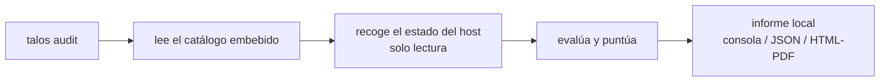

<p align="center">
  
</p>

# Talos

Talos audita el **bastionado** (hardening) de tus equipos y vigila su postura de
seguridad. Un solo binario, sin dependencias: mira cómo está configurada la
máquina, le pone nota de 0 a 100 y te dice qué arreglar y cómo. **Solo lee, nunca
toca el sistema.**

Lo ejecutas y te da un informe **en local**: sin servidor, sin cuenta y sin
enviar nada a ningún sitio. Funciona en Linux y Windows.

> Talos forma parte de una familia de herramientas propias, nativas de una
> plataforma de ciberseguridad mayor. Este repositorio lo publica como
> herramienta **independiente**: funciona por sí sola.

### El nombre

**Argos** eran los mil ojos que lo veían todo; **Talos**, el vigilante que hacía
la ronda. Dos centinelas que miran y no dejan pasar nada. Talos es la herramienta
que patrulla cada máquina y audita su seguridad.

---

## Qué hace

- **Los checks son datos.** El catálogo es un conjunto de fichas YAML: cada una
  describe qué leer, qué se considera correcto, su peso, su severidad y cómo
  remediarlo. Añadir una comprobación es escribir una ficha, no tocar código.
- **Solo lectura.** Lee estado (sysctl, ficheros, registro, cmdlets, versión de
  paquete...) a través de una **lista blanca** de lecturas. Sin shell arbitraria,
  sin remediación automática: la remediación es un consejo en texto.
- **Una nota clara.** Índice 0-100 ponderado; los "no aplica" no penalizan.
  Bandas rojo (<50) / amarillo (50-79) / verde (>=80), global y por categoría.
- **Repertorio propio de vulnerabilidades críticas por versión** (Linux): reglas
  **escritas y verificadas a mano** contra los *security trackers* de Debian y
  Ubuntu. Detectan paquetes sin parchear comparando con la versión corregida **por
  distribución y release** (sin falsos positivos por backport): PwnKit, Looney
  Tunables, regreSSHion, sudoedit, polkit, glibc iconv...
- **Informe usable.** Consola **con color y medidor**, JSON o **HTML imprimible a PDF**.

---

## Cómo funciona



Todo ocurre en la máquina. Nada sale a la red.

---

## El catálogo: qué comprueba

**141 comprobaciones** (105 Linux + 36 Windows), escritas como **datos** (fichas
YAML): cada una con su severidad, peso, criticidad, controles ENS y cómo remediarla.

- **Linux** - 12 categorías: SSH, KERNEL, FIREWALL, USERS, PORTS, UPDATES, MAC
  (SELinux/AppArmor), AUDIT, FS, SERVICES, TIME y VULN.
- **Windows** - 11 categorías: FIREWALL, SMB, CREDS, DEFENDER, SYSTEM, USERS, RDP,
  SERVICES, AUDIT, NAMERES y TLS (solo auditoría; en Windows nunca remedia).

Dentro de VULN va un **repertorio propio de reglas de vulnerabilidades críticas
por versión**, verificadas a mano contra los *security trackers* de Debian y Ubuntu:
escaladas locales y RCE como PwnKit, Looney Tunables, regreSSHion, sudoedit, polkit
o glibc iconv, detectadas por la versión del paquete instalada frente a la corregida
**por distribución y release** (sin falsos positivos por backport).

Los **perfiles** deciden cuántas se ejecutan: `core` (rápido, lo esencial) es el
de por defecto; **`--profile full`** corre el catálogo completo, incluido ese pack
de vulnerabilidades.

---

## Instalación

Talos es **un único ejecutable**, sin instalador, sin servicios y sin
dependencias. Tienes dos caminos: descargar el binario ya compilado (lo normal) o
compilarlo tú mismo.

### Opción A - Descargar el binario (recomendado)

No necesitas tener Go ni nada instalado. Coge el binario de tu sistema desde la
página de **[Releases](https://github.com/Shotafry/Talos/releases/latest)** y
listo.

**Linux** (elige `amd64` para PC/servidor Intel-AMD, o `arm64` para ARM):

```bash
# 1. descarga el binario
curl -fL -o talos https://github.com/Shotafry/Talos/releases/latest/download/talos-linux-amd64

# 2. (recomendado) verifica que no se ha corrompido ni manipulado
curl -fL -o SHA256SUMS https://github.com/Shotafry/Talos/releases/latest/download/SHA256SUMS
sha256sum --ignore-missing -c SHA256SUMS        # debe decir: talos-linux-amd64: OK

# 3. dale permiso de ejecución (es un BINARIO, no un script: no lo renombres a .sh ni uses 'bash')
chmod +x talos

# 4. ejecútalo. Si no lo pones en el PATH, llámalo con ./ delante
./talos audit

# (opcional) para tenerlo como 'talos' en todo el sistema:
sudo mv talos /usr/local/bin/talos && talos audit
```

**Windows** (PowerShell; `amd64` para la mayoría de equipos, `arm64` para ARM):

```powershell
# 1. descarga el binario
Invoke-WebRequest -Uri "https://github.com/Shotafry/Talos/releases/latest/download/talos-windows-amd64.exe" -OutFile "talos.exe"

# 2. (recomendado) compara el hash con el de la línea "talos-windows-amd64.exe" del fichero SHA256SUMS de la release
Get-FileHash .\talos.exe -Algorithm SHA256

# 3. ejecútalo (abre PowerShell "como administrador" para cobertura total)
.\talos.exe audit
```

> En Windows, si SmartScreen avisa de un binario sin firmar, es esperado (no está
> firmado con certificado de editor). Verifica el hash del paso 2 y continúa.

### Opción B - Compilar desde el código

Requiere **[Go 1.24 o superior](https://go.dev/dl/)**. El binario que produce es
estático (sin CGO) y no arrastra dependencias.

```bash
git clone https://github.com/Shotafry/Talos.git
cd Talos

go build -o talos .        # compila para tu sistema -> ./talos
./talos audit
```

Para compilar de una vez **todas** las plataformas (Linux y Windows, amd64 y
arm64) y generar `SHA256SUMS`, igual que hace la release:

```bash
./scripts/build.sh         # deja los binarios + SHA256SUMS en dist/
```

---

## Inicio rápido

Una vez tienes el binario:

```bash
talos audit                              # informe en consola, aquí y ahora
talos audit --format html -o talos.html  # informe imprimible a PDF (ábrelo e imprime)
talos audit --profile full               # análisis completo (+ repertorio de vulns por versión)
talos --help                             # todos los comandos y flags
```

Con root (Linux) o como Administrador (Windows) la cobertura es total. Sin
privilegios, las comprobaciones que los requieren se marcan "no aplica" (no
penalizan) y se avisa de ello.

---

## Los checks son datos

```
internal/catalog/checks/
  _meta.yaml      versión del catálogo + categorías
  linux/*.yaml    comprobaciones Linux + pack de vulns por versión
  windows/*.yaml  comprobaciones Windows (solo auditar)
```

```yaml
- id: SSH-01
  category: SSH
  os: linux
  description: "El acceso SSH directo como root debe estar prohibido."
  read: { type: sshd_t, key: permitrootlogin }
  comparator: eq
  expected: { good: "no", medium: ["prohibit-password"] }
  points: 8
  severity: high
  criticality: ALTA
  remediation: "En sshd_config pon PermitRootLogin no y recarga el servicio."
```

El catálogo viaja **embebido** en el binario, así que `talos audit` funciona
nada más descargarlo. `talos update` puede traer una versión más reciente del
catálogo desde las releases del proyecto, sin recompilar.

---

## Uso

```
talos audit [flags]   audita el host (por defecto)
talos catalog list    lista los checks
talos catalog lint    valida el catálogo
talos update          actualiza el catálogo
talos version         versión del binario

flags de audit:
  --profile core|deep|full|critical   (default core)
  --only <cat,cat>     limita a categorías
  --format json|html|text             (html = imprimible a PDF)
  --output, -o <file>  escribe a fichero
  --quiet, -q  /  --verbose, -v
```

El código de salida es útil en scripts y CI: `0` si todo bien, `1` si hay algún
fallo de severidad alta o crítica.

---

## Seguridad

- **Solo lectura.** Audita; no cambia nada. La remediación es texto, no una acción.
- **Lecturas en lista blanca.** No ejecuta comandos arbitrarios.
- **Sin red.** El informe es local; no envía datos a terceros.
- **Binarios verificados** por SHA256.

---

## Plataformas

| Plataforma | Cobertura |
| --- | --- |
| Linux (Debian/Ubuntu/RHEL/Alpine) | Auditoría completa + pack de vulns por versión |
| Windows 10/11 / Server | Auditoría (registro, directivas, Defender, cuentas...); nunca remedia |

---

## Inspiración

Talos es código propio, escrito desde cero. Se apoya en conocimiento **público**
de la disciplina: guías de configuración segura, la documentación oficial de los
fabricantes (claves de registro, parámetros del kernel, directivas de servicios)
y los trackers públicos de vulnerabilidades de las distribuciones. Más detalle en
[CREDITS.md](CREDITS.md).

## Licencia

Software propietario: uso permitido sin coste; prohibida la comercialización y la
copia o redistribución del código sin permiso. Ver [LICENSE](LICENSE). El autor
puede relicenciar en el futuro.

---

*Talos · by Argos · vigila, no toca.*
